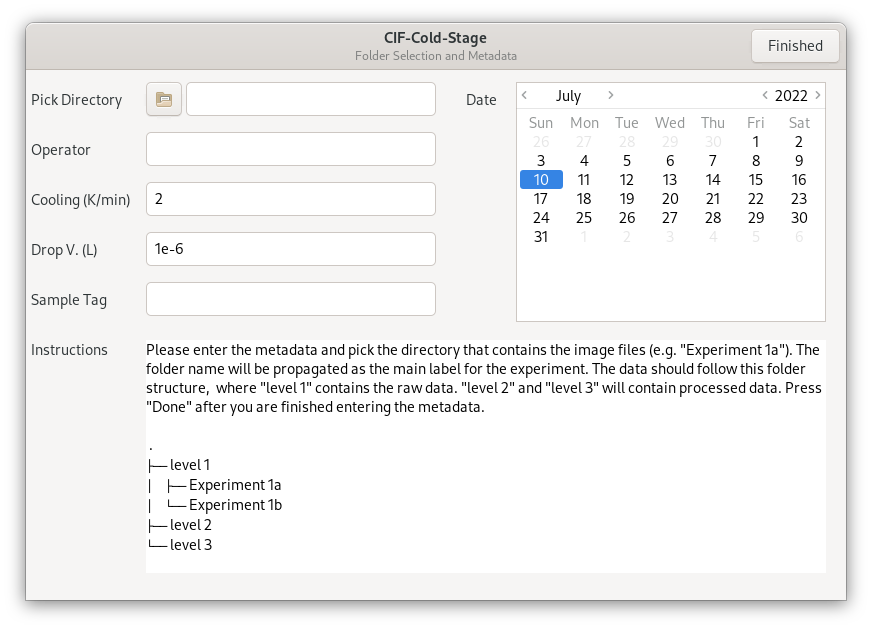
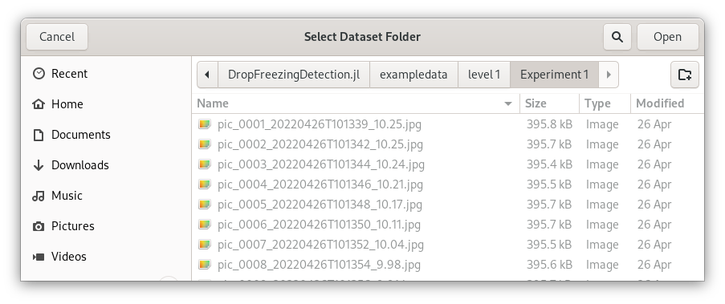
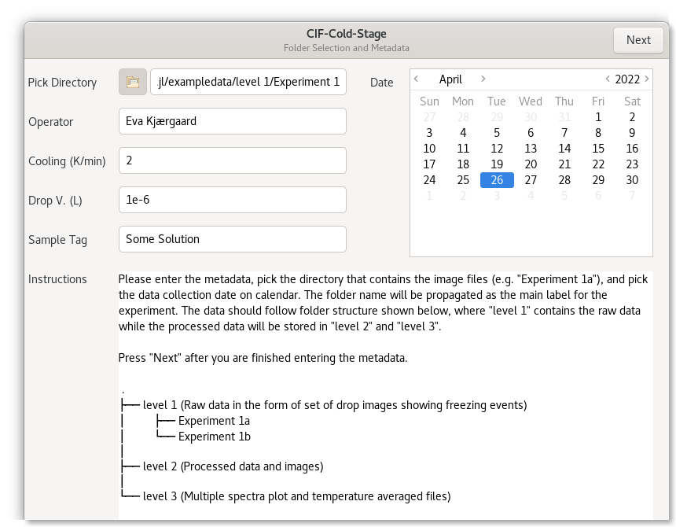
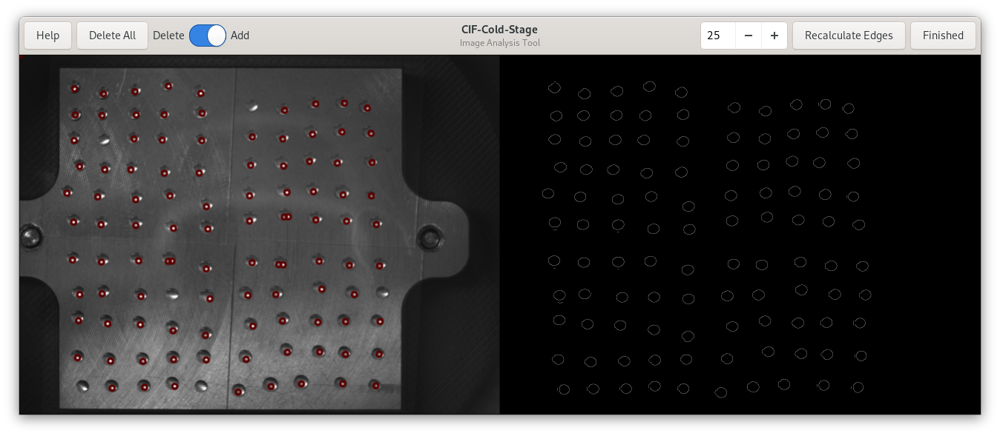
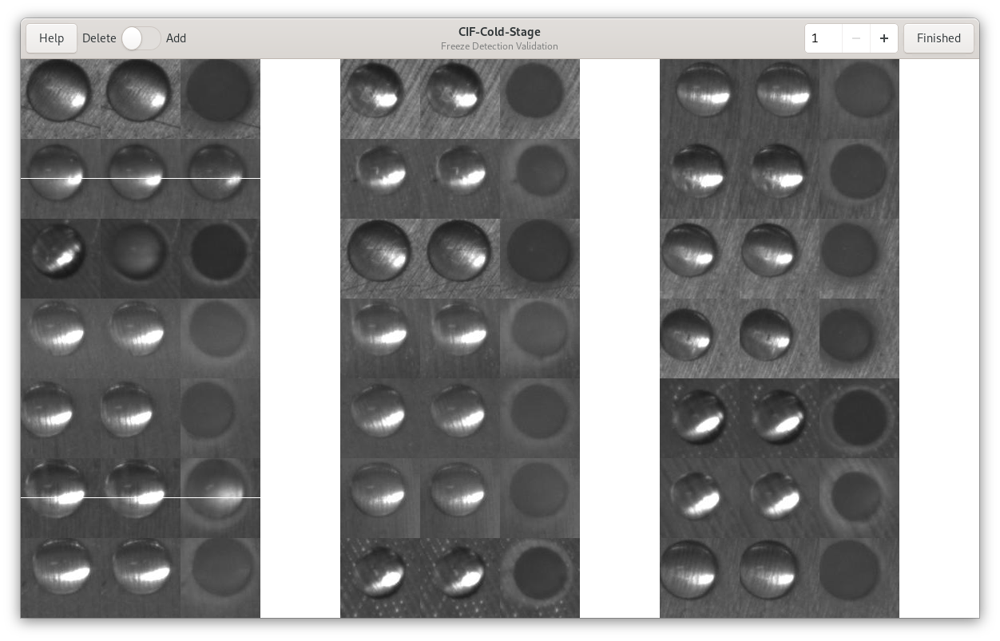
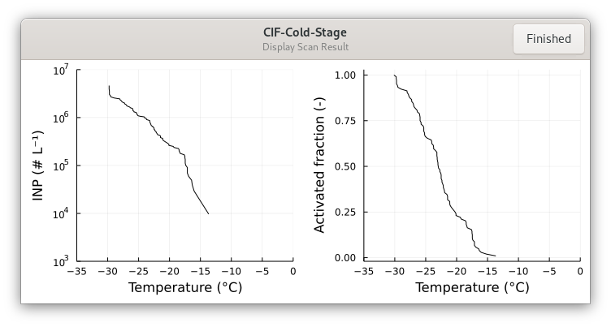

# DropFreezingDetection.jl
GUI software written in Julia to analyze drop freezing spectra from ice nucleation cold-stage measurements.

# About
This is a Julia language implementation of the [Drop-Freezing-Detection](https://github.com/CIF-Cold-Stage/Drop-Freezing-Detection) MATLAB code. The goals for the rewrite as as follows:
- Removal of the need to purchase a MATLAB license to run the code
- Application of a proper GUI toolkit
- Significant speedup of the data processing 
- Exposition of hyper parameters through the GUI
- Improved tracking of meta data without the need to edit code files
- Storage of results using a non-proprietary data format
- Faster validation of results through graphical groupings

**This work was supported by grant NSF AGS-2112978.**

# Installation
[Download](https://github.com/CIF-Cold-Stage/DropFreezingDetection.jl/archive/refs/heads/main.zip) the software through and extract the files. Alternatively, clone the directry using git

```bash
[user@host ~]$ git clone https://github.com/CIF-Cold-Stage/DropFreezingDetection.jl.git
```

The software is written in the Julia language. It should work on all platforms. The GUI toolkit is Gtk, which works best under Linux. Windows and Mac OS users may need to install some additional fonts. To install, download the current stable release [https://julialang.org/downloads/](https://julialang.org/downloads/) and install it on your computer.
 
Using a terminal emulator, navigate to the directory ```DropFreezingDetection/src``` and start julia with the project flag. 

```bash
[user@host ~]$ cd DropFreezingDetection/src
[user@host src]$ julia --project
```

```julia
               _
   _       _ _(_)_     |  Documentation: https://docs.julialang.org
  (_)     | (_) (_)    |
   _ _   _| |_  __ _   |  Type "?" for help, "]?" for Pkg help.
  | | | | | | |/ _` |  |
  | | |_| | | | (_| |  |  Version 1.7.2 (2022-02-06)
 _/ |\__'_|_|_|\__'_|  |  Official https://julialang.org/ release
|__/                   |

julia> 
```

Next use the closing square bracket ```]``` followed by enter to start the package manager.

```julia
julia> ] <PRESS RETURN>
pkg>
```

Next instantiate the project using the ```instantiate``` command. This will download all of the required dependencies. This step only needs to be performed once. 

```julia
pkg> instantiate
```

To return to the Julia REPL hit the delete key.

```julia
pkg> <PRESS DELETE>
julia>
```

To exit Julia press <CTRL-d>.

```julia
julia> <PRESS CTRL-d>
[user@host src]$
```

# Running the Program

To run the program from the shell run the following command:

```
[user@host src]$ julia --project main.jl
Step 0: Welcome. Please use the GUI to enter the metadata
```

The first time this will be slow due to the just in time compiler. Using a custom system image explained further below will address this. After a short while the following greeter will pop up.



Select a folder with drop images. For example ```exampledata/level 1/Experiment 1```



In addition, fill out the metadata, including the operator, cooling rate, drop volume, and sample tag. Use the calendar to set the data of sample collection.



Press ```Finished```. Next the software will parse the image and guess the location of each drop in the image. 

```bash
[user@host src]$ julia --project main.jl
Step 0: Welcome. Please use the GUI to enter the metadata
Step 1: Calculating drop centers. Please be patient.
```

The following screen will appear.



Each red circle corresponds to an identified drop. Some drops are missing a circle, some drops have two or more circles.

Click on a drop to manually add circles as needed. Toggle the switch on the top left of the header bar to off. Now clicks will remove the nearest neighbor circle. Remove all doublets (two in this image). If you remove too many circles, toggle and add them back in. You do not need to mark all circles. Removing a circle will effectively ignore the drop in the subsequent processing.

The figure to the right shows the identified edges. Depending on the image contrast, illumination, and droplet size, this edge detection may be insufficient, leading to too many edges and lots of false positive drop detection. The spin button with the value 25 is a hyper parameter that sets the spatial scale in the edge detection algorithm. You can change the value and press ```Recalculate Edges``` to try to improve the center detection. If it performs poorly, you can also press ```Delete All``` and then add all drops manually.

Press ```Finished``` when you are happy with the drop centers. Next the software will load and tile all images and transform the data into a stack. It will then search through the stack and identify freeze events. 

```bash
[user@host src]$ julia --project main.jl
Step 0: Welcome. Please use the GUI to enter the metadata
Step 1: Calculating drop centers. Please be patient.
Step 2: Loading and tiling files. A progress bar will appear shortly.
Progress: 100%|█████████████████████████████████████████| Time: 0:00:46
Step 3: Searching for freeze events.
Progress: 100%|█████████████████████████████████████████| Time: 0:00:01
```

The following validation window will appear


The freeze detection tries to identify changes in the image that correspond to freezing. The triplets correspond to an image sequence with suspected freezing. The droplet should turn from clear to opaque either in the second or third image. Sometimes the freeze detection is in error. For example the second triplet in the left most column. These can be manually removed as false positives. Click on the triplet to remove it.

A white line will appear and indicate that the drop is removed. Note that the first click has no effect and you will need to click twice. 



If a triplet is accidentally removed, it can be undone by switching the toggle button in the header bar and clicking on the triplet once more. 

Not all drops fit on a single page. Use the spin button on the top right to toggle through all drops. 

Press ```Finished```. Next the software will create a quick look and write processed data and metadata to the ```exampledata/level 2/Experiment 1/``` folder. 



The quicklook shows INP/L water (left) and activated fraction (right). The image is written to the ```level 2``` folder. Also written is a ```.csv``` file with drop centers and freezing temperature, a ```.csv``` file with the activated fraction and INP concentration vs. temperature, as well as image files that indicate the selected drops, drop centers, accepted drops, and discarded drops. 

Press ```Finished``` to exit the program.

# Compiling a System Image

Running the raw version of the software has some small but noticeable just-in-time compilation lag. To eliminate the lag, run the following. This only needs to be done once.

```bash
[user@host src]$ julia --project
```

```julia
julia> include("make_sysimg.jl")
```

The software will run as described above. Perform a normal processing, e.g. using one of the example data sets. This will write a file with precompile instructions. At the end the ```PackageCompiler``` will create a machine dependent custom system image that can be invoked at startup. This will take several minutes.

```julia
[ Info: PackageCompiler: Executing /home/petters/Documents/Research/NSF-AGS-2112978 (CIF)/DropFreezingDetection.jl/src/main.jl => /tmp/jl_packagecompiler_YaHfa4/jl_O37nT8
Step 1: Calculating drop centers. Please be patient.
Step 2: Loading and tiling files. A progress bar will appear shortly.
Progress: 100%|█████████████████████████████████████████| Time: 0:00:46
Step 3: Searching for freeze events.
Progress: 100%|█████████████████████████████████████████| Time: 0:00:01
[ Info: PackageCompiler: Done
✔ [05m:59s] PackageCompiler: compiling incremental system image
```

After a system image is created, the software can be started as follows

```bash
[user@host src]$ julia --project --sysimage sys_daq.so main.jl
```